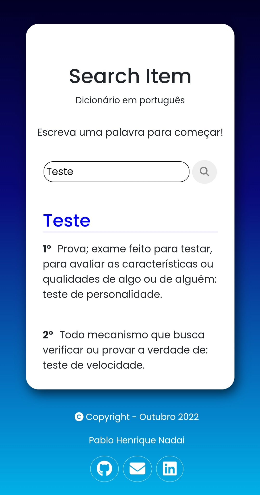

## 
Search Item

<strong>Projeto prático</strong>
 
Utilizar de APIs públicas para obter dados.
 

Tecnologias:
<ul>
  <li>Html</li>
  <li>Css Responsivo</li>
  <li>Javascript</li>
</ul>

### Preview
Visualização Desktop
 

 
Visualização Mobile
 

 

### Details

- Objective: Produzir uma website para consumir uma API(Interface de Programação de Aplicação).

- API utilizada: https://github.com/ThiagoNelsi/dicio-api
 
"O Dicio API permite buscas por diversas informações a respeito de milhares de palavras da língua portuguesa, todos os dados são extraídos do Dicio."
