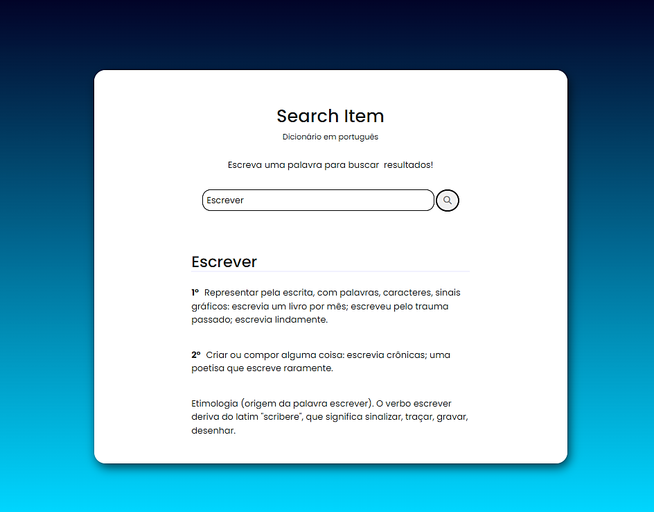

## 
Search Item

<strong>Projeto prático</strong>
### Web-Site

 

Tecnologias / Ferramentas utilizadas 🔍
<ul>
  <li>Html</li>
  <li>Css Responsivo</li>
  <li>Javascript</li>
</ul>

### Preview

  Desktop 💻
    
  

 

### Details

- Objetivo: Produzir uma website para consumir uma API(Interface de Programação de Aplicação) utilizando JS ou JQuery.

- API utilizada: https://github.com/ThiagoNelsi/dicio-api
 
"O Dicio API permite buscas por diversas informações a respeito de milhares de palavras da língua portuguesa, todos os dados são extraídos do Dicio."

  
Atualizações Futuras:
  - Integrar com API Pexels (Busca de imagens)
  - https://www.pexels.com/api/documentation/
